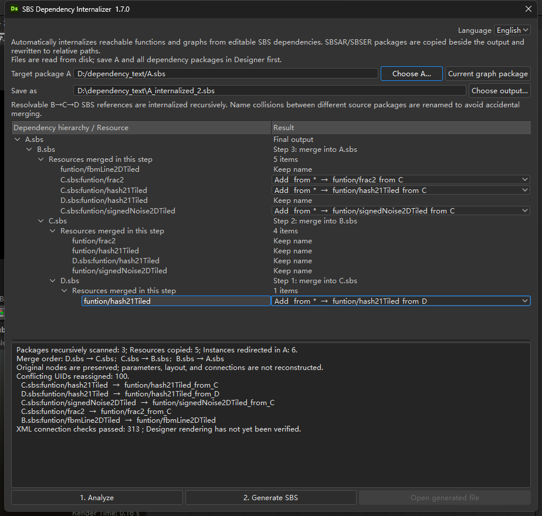

# SBS 依赖内部化插件 1.7.0

[中文](README_zh.md) | [English](README.md)

面向 Substance 3D Designer 16 / PySide6。将 A.sbs 引用的 B.sbs 内函数和材质 Graph 复制进 A，再将原来的实例引用指向 A 内新复制的资源。

插件使用 Designer 自带 Python 和 PySide6，以及 Python 标准库，不需要安装 Substance Automation Toolkit / PySBS，也不需要联网。

## 安装

1. 解压整个压缩包到一个固定文件夹。
2. Designer 中打开 **Tools → Plugin Manager**，使用 **Browse** 选择 `SBSDependencyInternalizer.py` 并加载。
3. 顶部出现 **SBS 依赖工具 → 依赖内部化…** 菜单。

如果当前版本的 Plugin Manager 没有选择 `.py` 的 Browse 入口：进入 **Edit → Preferences → Projects → 当前 Project File → Python**，将 `SBSDependencyInternalizer.py` 所在文件夹加入插件搜索路径，重启 Designer，然后在 Plugin Manager 中加载插件。

这是 Python 源码插件。不要将普通 ZIP 当成 `.sdplugin` 安装包直接安装。

## 项目文件

| 路径 | 用途 |
| --- | --- |
| `SBSDependencyInternalizer.py` | Designer 插件入口。 |
| `DependencyInternalizer.py` | XML 分析、递归合并、依赖迁移、命令行和 PySide6 界面。 |
| `pluginInfo.json` | 插件版本及最低 Designer 版本信息。 |
| `tests/` | 不依赖 Designer 的标准库回归测试。 |

`dependency_text/` 中是用户提供的模拟包、生成结果、自动保存和编译素材，因此不会提交到公开仓库。

## 使用

1. **先在 Designer 中保存 A 及其依赖包**。插件读取磁盘文件，不读取尚未保存的编辑状态。
2. 打开插件，点击“当前图所在包”获取 A；也可以点击“选择 A…”选择文件。
   窗口顶部可随时在“中文 / English”之间切换；语言选择会保存，切换时不会清除已有分析和同名处理选择。
3. 点击“1. 分析合并”，插件会自动发现所有可定位的可编辑 SBS 依赖。
4. 依赖按树的叶子到根节点逐步合并，例如 D→C、C→B、B→A。对每一步存在同名冲突的资源，直接在“处理结果”列逐项选择“加 `_from_*`”或“覆盖同名资源”；每次选择都会自动重新计算后续步骤。
5. 确定新的输出文件名，点击“2. 生成 SBS”。日志会按执行顺序记录每一级内存合并、资源处理方式和最终写出路径，再点击“打开生成文件”检查结果。

## 行为

- 自动复制 A 实际引用的函数 / 材质 Graph，包括其在 B、C、D 等包中继续调用的资源；不复制无关内容。
- 保留 A 原实例节点及其参数、动态参数、继承设置、位置、连线。通过修改 XML 引用完成切换，不删除再重建节点。
- 使用当前包自身依赖 `?himself`；自动处理 A / B 依赖 UID 不同的情况。
- 保留原有分组路径。合并从最深依赖开始逐级向 A 进行；每一级的同名冲突默认添加 `_from_B` 等后缀，也可在分析树中独立选择覆盖。前一级的结果会作为整体参与下一级冲突计算。
- 遇到资源、节点或接口 UID 冲突时分配新 UID，并更新复制内容中的结构引用；不改数值常量。
- 保留实例输出 UID 和输出标识符之间的桥接，保留 A 原有输出连接。
- 保留 Designer 官方依赖，例如 `sbs://functions.sbs`，交由 Designer 解析。
- B 引用的可编辑 C.sbs、C 再引用的 D.sbs 等会按实际可达资源递归内部化；支持多分支和循环依赖去重，不会复制未被使用的资源。
- 如果 A 本身也直接引用了递归链中的 C、D，会一起重定向到本次导入的内部资源，并移除已经不再需要的对应外部依赖。
- 分析结果使用可展开的树形视图展示包层级和资源映射；重复分支及循环引用只展开一次并给出标记。Designer 内置的 `sbs://` 依赖不会显示在树和文字分析中。
- 生成日志按 D→C、C→B、B→A 的实际顺序输出，并逐项记录保持名称、更名或覆盖结果；中间步骤只在内存执行。
- `sbs://` 内置包、Designer 路径别名和缺失文件会继续保留为外部依赖。可定位的 `.sbsar` 以及兼容扩展名 `.sbser` 会自动复制到输出文件旁的 `<输出名>_dependencies` 目录，输出 SBS 中的引用同时改为相对路径。同名的不同编译包会自动添加 `_2` 等后缀，不覆盖已有文件。
- 仅创建新的输出文件；不覆盖 A、B 或已有输出。新 SBS 使用独立 fileUID，便于与 A 同时打开。
- 分析完成后，如果 A 或任一递归来源包在磁盘上发生变化，会要求重新分析。

## 本版支持范围

支持可编辑 SBS 中的函数实例和普通材质 Graph 实例。编译包 SBSAR/SBSER 只进行文件迁移和路径改写，不反编译、不参与节点资源合并。针对待内部化依赖的位图、SVG、模型等资源收集，以及不认识的引用字段，本版会中止并报告，不会悄悄忽略后继续生成。

输入 SBS 的 formatVersion 必须一致；不一致时请用同一个 Designer 版本分别打开并保存，再合并。自定义路径别名依然需要在 Designer 项目中定义。

如果 A 自己含媒体资源，结果必须保存在 A 的同一文件夹，避免改变相对媒体路径。插件不提供原位修改当前内存图 / 一键撤销；结果为新文件。

## 已完成的验证

- 使用你提供的 A/B 文件，复制 6 个函数，检查 204 条连接。
- A 主图的 XML 与原主图一致；函数资源与已确认可用的合并结果一致。
- 验证不同自身依赖 UID、已有自身依赖、同名资源冲突、分组重名、资源 UID 冲突、内置依赖 UID 冲突、嵌套调用、其他依赖路径重定位。
- 验证普通 Graph 多输出桥接及 UID 冲突。
- 验证缺失资源、不支持的资源、输入接口不匹配、文件变化和避免覆盖输入文件。
- 共 24 项自动测试通过，包括中英文界面和日志、自动发现、逐层逐资源同名策略、生成步骤日志、实际 D→C→B→A 逆序合并、多分支与循环引用，以及 SBSAR/SBSER 迁移、相对路径改写和防覆盖，另通过 Python 语法检查。

**尚未在真实 Designer 16 进程中运行插件界面或执行渲染。** XML 核心已用实际样例验证；安装后仍需要在你的 Designer 中验证菜单加载和计算结果。

## 附带测试

`tests/fixtures` 包含此次用于验证的 A、B 和已接受结果，仅用于回归测试。不要将这些测试文件作为需要安装的插件。

在此目录运行：

```bash
python -m unittest discover -s tests -v
```

无需安装 PySide6 或 Designer 即可运行 XML 核心测试，因为界面模块仅在 Designer 加载时导入。

## 可选：命令行

自动分析并合并所有可编辑 SBS 依赖：

```bash
python DependencyInternalizer.py --host "D:/Materials/A.sbs" --output "D:/Materials/A_internalized.sbs"
```

覆盖 A 中同路径、同类型的原资源：

```bash
python DependencyInternalizer.py --host "D:/Materials/A.sbs" --output "D:/Materials/A_internalized.sbs" --collision-policy replace
```

仍可使用 `--scan` 查看依赖，或同时提供 `--source` 和 `--dependency-id` 只处理指定入口。

## 官方接口参考

- Python 插件入口：https://experienceleague.adobe.com/en/docs/substance-3d-designer/using/scripting/plugin-basics
- UI Manager 菜单与窗口：https://experienceleague.adobe.com/en/docs/substance-3d-designer/using/scripting/creating-user-interface-elements
- 插件搜索路径：https://experienceleague.adobe.com/en/docs/substance-3d-designer/using/scripting/plugin-search-paths
- 实例输出桥接数据：https://adobedocs.github.io/substance-automation-toolkit/pysbs/compnode/common.html
